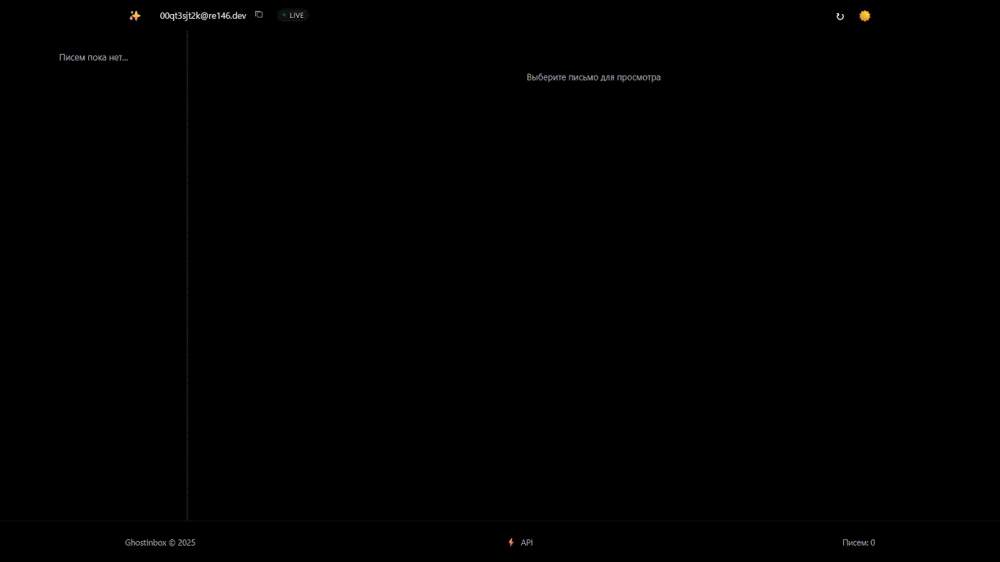

# 👻 GhostInbox


Минималистичный и современный сервис временной почты с автоматическим обновлением и стильным интерфейсом. GhostInbox предоставляет безопасный способ получения временных email-адресов для регистрации на сайтах, тестирования или защиты вашей основной почты от спама.

<div align="center">
  
</div>

## ✨ Особенности

- **Мгновенное создание** 
  - Создание временного почтового ящика одним кликом
  - Автоматическое копирование адреса в буфер обмена
  - Неограниченное количество ящиков

- **Автообновление и Real-time уведомления** 
  - Автоматическая проверка новых писем каждые 15 секунд
  - Визуальный индикатор статуса обновления
  - Push-уведомления о новых письмах
  - Отображение времени последнего обновления

- **Современный интерфейс** 
  - Адаптивный минималистичный дизайн
  - Поддержка светлой и тёмной темы
  - Анимации и плавные переходы
  - Интуитивно понятная навигация
  - Регулируемая ширина панелей

- **Работа с письмами**
  - Просмотр HTML и текстовых писем
  - Загрузка писем в формате TXT
  - Удобная навигация по списку
  - Детальная информация об отправителе
  - Поддержка вложений

- **Безопасность и конфиденциальность**
  - Временные адреса для защиты основной почты
  - Автоматическое удаление писем через 24 часа
  - Отсутствие необходимости регистрации
  - Защита от спама и вредоносного контента

## 🚀 Технологии

### Frontend
- React.js для построения пользовательского интерфейса
- CSS Variables для гибкой темизации
- CSS Grid и Flexbox для адаптивного дизайна
- React Hooks для управления состоянием
- Custom Hooks для переиспользуемой логики
- CSS анимации и transitions

### Backend
- Express.js для API сервера
- Node.js для серверной логики
- WebSocket для real-time обновлений
- RESTful API архитектура
- Кэширование и оптимизация запросов

### Инструменты разработки
- Create React App для настройки проекта
- ESLint для статического анализа кода
- Prettier для форматирования
- Git для версионного контроля

## 🔒 Безопасность

GhostInbox уделяет особое внимание безопасности:

- Все соединения защищены SSL/TLS
- Письма хранятся во временном хранилище
- Отсутствие сохранения личных данных
- Защита от XSS и инъекций


## 🛠 Установка

1. Клонируйте репозиторий:
```bash
git clone https://github.com/yourusername/ghostinbox.git
cd ghostinbox
```

2. Установите зависимости для клиента и сервера:
```bash
# Установка зависимостей клиента
cd client
npm install

# Установка зависимостей сервера
cd ../server
npm install
```

3. Создайте `.env` файл в папке сервера:
```env
PORT=3001
API_URL=https://mail.re146.dev/api
```

4. Запустите проект:
```bash
# Запуск сервера
cd server
npm start

# Запуск клиента (в новом терминале)
cd client
npm start
```

## 💻 Использование

1. Откройте приложение в браузере (по умолчанию http://localhost:3000)
2. Нажмите кнопку ✨ для создания временного почтового ящика
3. Используйте полученный адрес для получения писем
4. Письма будут автоматически появляться в интерфейсе

## 🔧 API

Проект использует API временной почты. Документация доступна по адресу:
https://mail.re146.dev/api/swagger/#/

## 🤝 Вклад в проект

Мы приветствуем ваш вклад в развитие проекта! Для этого:

1. Форкните репозиторий
2. Создайте ветку для ваших изменений
3. Внесите изменения и создайте Pull Request

## 📝 Лицензия

Проект распространяется под лицензией MIT. Подробности в файле [LICENSE](LICENSE)

## 🌟 Благодарности

- [mail.re146.dev](https://mail.re146.dev) за предоставление API временной почты

## 📞 Поддержка

Если у вас возникли вопросы или проблемы:
- Напишите в Telegram: @MrMeowMurk

---

<div align="center">
Сделано с ❤️ MeowMurk
</div>
